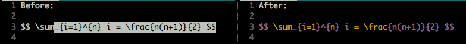
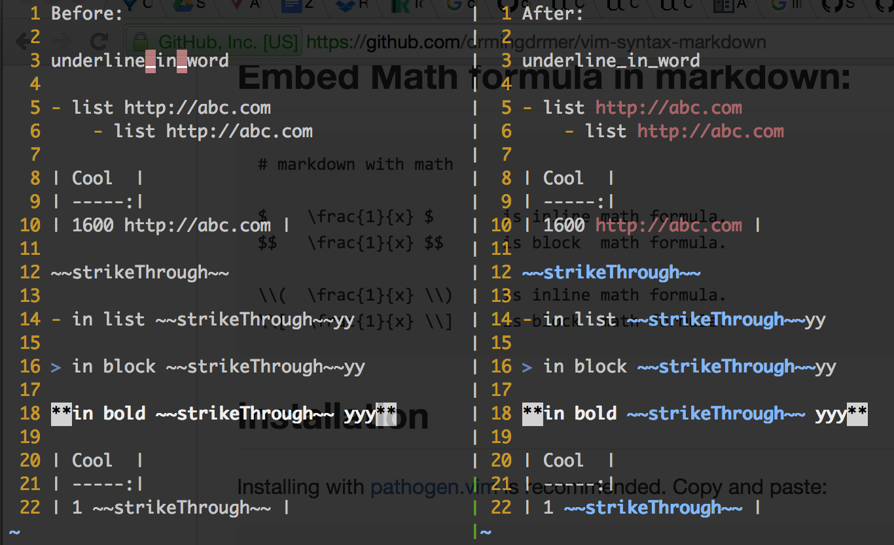

# vim-syntax-markdown

VIM syntax for markdown with nested MathJax(in LaTeX) support.

## Before and After using this plugin:


<!-- <style> -->
<!--     img { -->
<!--         max-width: 100%; -->
<!--     } -->
<!-- </style> -->

## Github Flavored Markdown Support

Reference: https://help.github.com/articles/github-flavored-markdown/

Support:
-   `_` as key_word instead of as an_error.
-   Highlight url: http://abc.com .
-   `~~` creates ~~strikethrough~~.



## Embed Math formula in markdown:
```
# markdown with math

$    \frac{1}{x} $       is inline math formula.
$$   \frac{1}{x} $$      is block  math formula.

\\(  \frac{1}{x} \\)     is inline math formula.
\\[  \frac{1}{x} \\]     is block  math formula.
```

##  Installation

Installing with [pathogen.vim](https://github.com/tpope/vim-pathogen)
 is recommended. Copy and paste:

```sh
cd ~/.vim/bundle
git clone git://github.com/drmingdrmer/vim-syntax-markdown.git
```

Or manually:

Download [vim-syntax-markdown.zip](https://github.com/drmingdrmer/vim-syntax-markdown/archive/master.zip)
and unzip it into `~/.vim`.

## Credit

@[c42f](//github.com/c42f)
